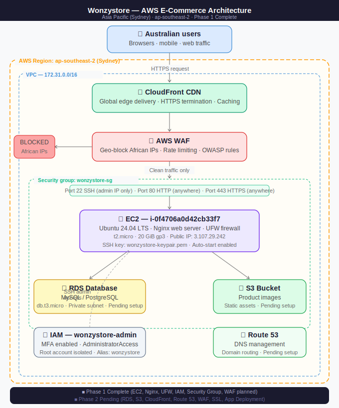

# 🛒 Wonzystore — AWS E-Commerce Deployment


A full production-grade AWS cloud infrastructure deployment for an e-commerce web platform targeting the Australian market. Built and managed by a Network Security Engineer with 17+ years of experience.

---

## 🏗 Architecture Overview



---

## ✅ Phase 1 — Infrastructure Setup (Complete)

### AWS Account & Security
- Dedicated AWS account with business email
- Region: Asia Pacific (Sydney) `ap-southeast-2`
- Root account isolated — MFA enabled on both root and IAM user
- IAM admin user: `wonzystore-admin` with AdministratorAccess
- Custom account alias: `wonzystore`
- Zero-spend billing alert configured
- Cost Explorer activated

### EC2 Server
| Property | Value |
|---|---|
| Instance ID | `i-0f4706a0d42cb33f7` |
| Instance Type | `t2.micro` (1 vCPU, 1 GiB RAM) |
| OS | Ubuntu Server 24.04 LTS |
| Public IP | `3.107.29.242` |
| Storage | 20 GiB gp3 |
| Region | ap-southeast-2 (Sydney) |

### Security Group — `wonzystore-sg`
| Rule | Protocol | Port | Source |
|---|---|---|---|
| SSH | TCP | 22 | Admin IPs only |
| HTTP | TCP | 80 | 0.0.0.0/0 |
| HTTPS | TCP | 443 | 0.0.0.0/0 |
| App | TCP | 8080 | 0.0.0.0/0 |

### Web Server & Firewall
```bash
sudo apt install nginx -y
sudo systemctl enable nginx
sudo ufw allow OpenSSH
sudo ufw allow 'Nginx Full'
sudo ufw enable
```

---

## ✅ Phase 2 — Application Deployment (Complete)

### Django Application
- Framework: **Django** with **Gunicorn** (3 workers)
- App running on: `127.0.0.1:8080`
- Nginx configured as reverse proxy
- Static files served via Nginx
- Media files served via Nginx
- Systemd service configured for auto-restart

### PostgreSQL Database (AWS RDS)
| Property | Value |
|---|---|
| Engine | PostgreSQL 18.3 |
| Instance | db.t3.micro |
| Storage | 20 GiB gp3 |
| Region | ap-southeast-2a |
| Access | Private (VPC only) |
| Connection | Via EC2 compute resource |

### Developer Access
- Separate SSH user created: `developer`
- SSH key-based authentication only
- Sudo access for deployment tasks
- No password login permitted

### CI/CD Pipeline — GitHub Actions
Automatic deployment triggered on every push to `master` branch:

```
Developer pushes code to GitHub
        ↓
GitHub Actions detects push
        ↓
SSH into EC2 server
        ↓
git pull origin master
        ↓
pip install -r requirements.txt
        ↓
python manage.py migrate
        ↓
python manage.py collectstatic
        ↓
sudo systemctl restart wonzay
        ↓
Site updated live ✅
```

### African IP Geo-blocking
Blocked all African countries using **MaxMind GeoLite2** database integrated with Nginx:

```nginx
geoip2 /var/lib/GeoIP/GeoLite2-Country.mmdb {
    auto_reload 5m;
    $geoip2_data_country_code country iso_code;
}

map $geoip2_data_country_code $blocked_country {
    default 0;
    NG 1; GH 1; ZA 1; KE 1; EG 1; ET 1; TZ 1;
    UG 1; DZ 1; MA 1; CM 1; CI 1; SN 1; ZW 1;
    ZM 1; MZ 1; AO 1; SD 1; TN 1; LY 1;
}
```

- Weekly automatic database updates via cron job
- Admin IPs whitelisted for testing
- Returns 403 for blocked regions

---

## ⏳ Phase 3 — Pending

- [ ] Domain name purchase and DNS configuration
- [ ] SSL/HTTPS certificate (Let's Encrypt)
- [ ] Cloudflare CDN + WAF integration
- [ ] Enhanced geo-blocking via Cloudflare

---

## 💰 Monthly Cost

| Service | Cost |
|---|---|
| EC2 t2.micro (free tier) | $0.00 |
| RDS db.t3.micro | ~$20.44 |
| Storage | ~$2.76 |
| **Total** | **~$23.20/month** |

---

## 🔒 Security Architecture

| Layer | Control |
|---|---|
| Geographic | MaxMind GeoIP2 + Nginx (African IPs blocked) |
| Application | Nginx reverse proxy + Django |
| Network | AWS Security Group (least privilege) |
| Host | UFW firewall on EC2 |
| Identity | IAM + MFA + root isolation |
| Access | SSH key-based auth only |
| Database | Private VPC — no public access |
| CI/CD | GitHub Secrets for SSH credentials |

---

## 🗂 Project Structure

```
aws-ecommerce-deployment/
├── README.md           # This file
├── architecture.svg    # AWS infrastructure diagram
├── DEPLOYMENT.md       # Step-by-step deployment log
└── .github/
    └── workflows/
        └── deploy.yml  # GitHub Actions CI/CD pipeline
```

---

## 👨‍💻 Author

**Mozypelly** — Network Security Engineer & Ethical Hacker
- 17+ years in network engineering and cybersecurity
- 𝕏: [@mozypellyXP](https://x.com/mozypellyXP)
- GitHub: [Mozypelly10](https://github.com/Mozypelly10)
